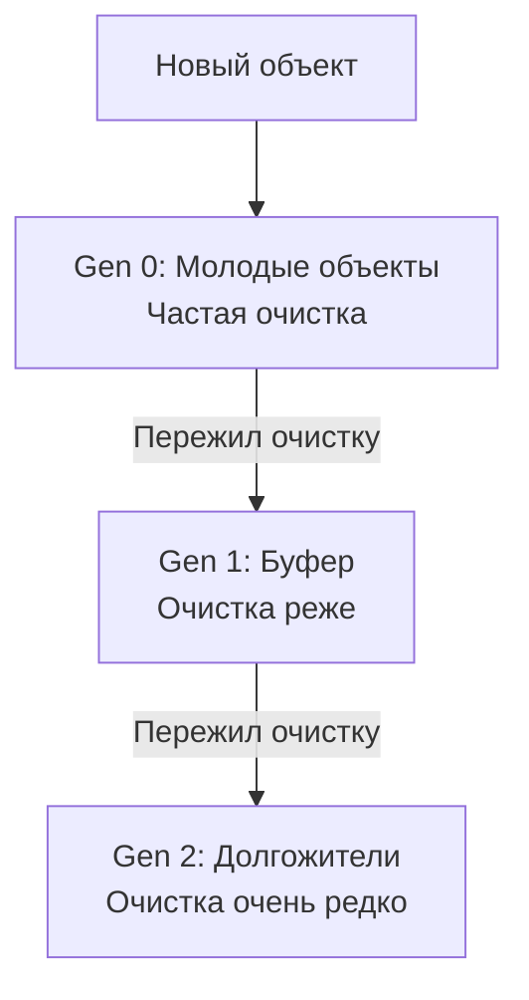

В этом разделе речь пойдет о самой базовой теме, с которой сталкивается C# разработчик. А именно о том, как наш код на высокоуровневом языке программирования превращается в инструкции для процессора да еще и под разные архитектуры.

---

## Глава 1. Архитектура процессора

С программной точки зрения архитектура процессора — это совместимость с определённым набором команд, их структура (система адресации, набор регистров) и способ исполнения (счётчик команд).
С аппаратной точки зрения архитектура процессора — это набор свойств и качеств, присущий целому семейству процессоров.

Существует много различных архитектур, но я расскажу про 2 основных семейства:
-   **x86/x86-64**
-   **ARM**

#### **x86/x86-64**

> **Происхождение:** Intel, AMD  
> **Архитектура:** CISC (Complex Instruction Set Computing)

Это семейство используется в процессорах от Intel и AMD. Оно основано на архитектуре CISC (Complex Instruction Set Computing). Проще говоря, эта архитектура включает в себя большое количество различных инструкций (и больших и маленьких), что делает его удобным с точки зрения ручного написания программ (на низкоуровневых языках по типу ассемблера), так как для большинства задач уже реализована инструкция. Иногда даже в набор инструкций включались инструкции для поддержки конструкций языков высокого уровня.

Но есть и минус в таком подходе, а именно в том, что большинство инструкций часто обращались к оперативной памяти (из-за того, что и операнды, и результат в арифметических операциях могли храниться не только в регистрах, но и в оперативной памяти), что сравнительно медленнее, чем обращение к регистрам.

#### **ARM**

> **Происхождение:** Apple, Qualcomm, Broadcom  
> **Архитектура:** RISC (Reduced Instruction Set Computer)

Это семейство используется в процессорах от Apple. И оно основано на архитектуре RISC (Reduced Instruction Set Computer). Эта архитектура, наоборот, содержит простые, быстрые и ограниченные наборы инструкций. Например, в первых процессорах на этой архитектуре не было даже команд умножения и деления. Смысл был в том, чтобы все инструкции могли выполняться за один такт процессора. Поэтому обращение к оперативной памяти вынесли в отдельные инструкции load/store, а все остальные инструкции работали в рамках регистров процессора. Такие процессоры считаются более энергоэффективными.

> **Другие архитектуры:**
> Существуют также VLIW (Very Long Instruction Word) и MISC (Minimal Instruction Set Computer) архитектуры.
>
> -   **VLIW** характеризуется тем, что инструкция содержит несколько операций, которые должны выполняться параллельно. Такая архитектура используется в процессорах от «Эльбрус» и видеопроцессорах AMD/ATI Radeon, в которых несколько вычислительных устройств.
> -   **MISC** — архитектура процессоров с минимальным набором доступных для выполнения операций. Нужна чтобы снизить электропотребление и уменьшить итоговую стоимость процессора. Такая архитектура используется в процессорах для IoT (Internet of Things) сегмента.
>
> В целом нас особо не интересуют эти архитектуры.

Однако современные процессоры x86 могут содержать RISC-ядро, декодируя сложные CISC-инструкции на микрокоманды, а в современные RISC-процессоры добавляют все больше инструкций.

**Так вот, как же наш код на C# одинаково работает на разных архитектурах процессоров?**

---

## Глава 2. Этапы компиляции

Из первой главы мы поняли, что существуют разные архитектуры и они не похожи друг на друга, но почему в итоге нам все равно, на какой архитектуре работает наша машина? Давайте разбираться.

#### **Этап 1. Первая компиляция (от C# к IL)**

На данном этапе происходит переработка нашего кода на C# (с помощью компилятора Roslyn) в аппаратно-независимый язык IL (Intermediate Language), который похож на ассемблер, но не привязан к конкретной архитектуре процессора. Это такой промежуточный язык, который будет перерабатываться на следующих этапах компиляции.

Также на данном этапе происходит синтаксическая и семантическая проверка кода. С синтаксической проверкой все понятно — проверяет, правильно ли мы пишем ключевые слова, название используемых функций и т.д. А семантическая проверка кода — это процесс, при котором проверяется код с точки зрения смысла. Например, правильно ли мы используем типы данных или правильно ли управляем потоком (например, нет ли break вне цикла) и т.д.

В итоге после всего этого пережевывания C#-кода у нас получается файл `.exe` (если это приложение) или `.dll` (если это, например, библиотека классов), хранящий в себе IL-код и метаданные (информация о всех типах, их методах, полях, свойствах, зависимостях и т.д.).
Это не настоящая программа для процессора, а так называемый **управляемый код (managed code)**, которому нужна среда выполнения.

**Что же его ждет дальше?**

#### **Этап 2. Runtime (CLR)**


У нас есть промежуточный код на языке IL и метаданные. Все это дело передается в так называемый Common Language Runtime или же CLR. Это виртуальная машина .NET, которая занимается управлением выполнения кода. Она загружает IL-код, читает метаданные, находит точку входа в программу (например, Main) и т.д. Далее происходит либо JIT, либо AOT компиляция IL-кода в машинные инструкции для конкретной архитектуры процессора.

#### **Этап 3. JIT/AOT компиляция.**

#### **JIT (Just In Time)**

В данном подходе происходит компиляция прямо на лету во время выполнения программы. То есть, например, CLR видит, в IL-коде вызывается какой-то метод, он его берет и компилирует в нативный машинный код (то есть преобразует из аппаратно-независимого IL-кода в аппаратно-зависимый машинный код для конкретной архитектуры процессора).

Также в JIT-компиляции существует ряд оптимизаций:

-   **Встраивание метода (Inlining).**
    Если есть какой-то небольшой метод, то JIT может встроить блок кода из этого метода вместо строки с его вызовом, если это будет дешевле, чем вызов.

    ```csharp
    public void Foo()
    {
        Console.WriteLine("Hi");
    }

    // Вызов Foo() может быть заменен на:
    Console.WriteLine("Hi");
    ```

-   **Удаление мертвого кода (Dead Code Elimination).**
    Если есть фрагменты кода, которые никогда не выполнятся, например:

	```csharp
    if (false)
    {...}
    
    // или
    int x = 5;
    x = 7;
    return x;
    // Строка 'x = 5;' может быть удалена
    ```

-   **Сворачивание констант (Constant Folding).**
    Все константы вычисляются заранее.

	```csharp
    int x = 2 * 3; // -> int x = 6;
    ```

-   **Использование специфичных инструкций CPU (SIMD-инструкции).**
    Если JIT видит, что процессор поддерживает, например, набор инструкций AVX (для x64) или NEON (для ARM64) для векторных операций, он может выдать более эффективный код.

#### **Многоуровневая компиляция (Tiered Compilation).**

В современных .NET (.NET Core 3.0 +) используется многоуровневая компиляция. Сначала JIT компилирует все подряд без оптимизаций, чтобы программа быстро запустилась. Затем уже в процессе в фоновом режиме происходит оптимизация кода. Например, если есть метод, который вызывается много раз (называется "горячий"), то JIT не станет каждый раз его IL-код компилировать в нативный код, а один раз скомпилирует его со всеми оптимизациями и положит в таблицу в оперативной памяти (метод в IL-коде -> метод в нативном виде), к которой в последствие будет обращаться.
В конце концов все методы хранятся в таблице в оперативной памяти.

Таким образом достигается высокая скорость выполнения программы, но увеличивается потребление памяти и время компиляции.

#### **AOT (Ahead Of Time)**

В этом подходе весь код на C# компилируется заранее в нативный код и упаковывается вместе со сборкой, а не во время выполнения.
Существует 2 варианта такой компиляции:
-   **ReadyToRun (R2R)**
-   **NativeAOT**

**ReadyToRun** — происходит частичная компиляция IL-кода в нативный код для конкретной платформы, но также сохраняется возможность дополнительной JIT-компиляции.

**NativeAOT** — здесь весь код сразу превращается в нативный без возможности JIT-компиляций во время выполнения программы.
Такой подход нужен, если известна конечная аппаратная часть машины, на которой будет работать программа. Уменьшается время запуска программы, так как весь код уже скомпилирован в нативный заранее.

#### **Этап 4. Сборка мусора (Garbage Collector или GC).**

> **Философия:** Большинство объектов живут недолго, а те, кто живет дольше, скорее всего, проживут еще дольше.

В .NET GC устроен так, что объекты разделены на поколения.
-   **Gen 0**
-   **Gen 1**
-   **Gen 2**

Такое разделение нужно, чтобы не бегать все время по куче и искать те объекты, которые можно уже удалить.



-   **Gen 0.**
    Это самые "молодые" объекты, у которых маленькая область видимости, например, локальные переменные. Под это поколение обычно отводится от 256 КБ до 4 МБ (но объем может меняться). В этом поколении GC вырезает объекты чаще всего, но если какие-то объекты пережили чистку в Gen 0, то они попадают в Gen 1.

-   **Gen 1.**
    Если Gen 0 уже переполнен, а очистка уже прошла, то объекты переходят в Gen 1. Это такой промежуточный этап перед Gen 2 (некий буфер). Здесь очистка происходит реже, чем в Gen 0.

-   **Gen 2.**
    Тут находятся долгоживущие объекты, такие как кеши, синглтоны, статические поля и т.д., которые пережили очистку в Gen 1. Очистка в этом поколении происходит только при больших циклах сборки (когда системе не хватает памяти).

Так как на время чистки все управляемые потоки приостанавливаются (чтобы граф объектов не менялся для корректного определения, какие объекты уже мертвы), то эффективность этого процесса очень важна. Для этого и существует такое разделение на поколения, чтобы максимально быстро и эффективно проводить очистку.

Для большей оптимизации сборки мусора в .NET GC разделили на 2 типа:
-   Workstation GC (with Concurrent/without Concurrent)
-   Server GC

Подробно разбирать их в этой статье я не буду, но основное различие в том, что Workstation GC оптимизирован под клиентские приложения для работы с UI, а Server GC — для серверных приложений по типу ASP.NET Core.

Тема сборщика мусора достаточно плотно связана с темой устройства памяти в .NET. В следующих статьях мы разберем ее.

---

## Глава 3. Роль операционной системы

Описывая процесс преобразования кода в машинные инструкции, нельзя не рассказать про роль операционной системы во всей этой схеме. 

После того, как мы запустили наше приложение (.exe) ОС должна проверить заголовок файла, чтобы установить является ли он валидным исполняемым файлом.

Если никаких проблем не возникает, то ОС создает новый процесс под наше приложение. Это некое пространство, в котором живет наше приложение со своими ресурсами такими, как виртуальная память, таблица дескрипторов и т.п.

Наше приложение не может напрямую работать с железом, так как по мимо него есть еще множество процессов, которые выполняются в операционной системе. Для организации корректной работы всех процессов на компьютере нужен менеджер, который будет грамотно распределять ресурсы и контролировать доступ к железу. Как раз ОС и является этим менеджером, то есть своего рода прослойкой между железом и софтом.

Некоторые функции ОС:
 - Виртуальная память
 - Таблица дескрипторов
 - Приоритет процессов

#### Виртуальная память 

Каждому процессу выделяется виртуальная память, по сути создается иллюзия того, что у процесса есть собственное адресное пространство большого размера (например, 4 Гб на 32-битной системе). И наш процесс работает с этой памятью, а вот ОС и процессор (с помощью MMU - Memory Management Unit) переводит эти виртуальные адреса в физические.

Это нужно для того, чтобы разные процессы не "залезали" друг другу в память. Например, есть процессы А и Б. А работает со своим виртуальным адресом 0x00100000 и Б работает со своим виртуальным адресом 0x00100000. Но эти 2 адреса указывают на разные физические адреса, поэтому никакой проблемы нет.

#### Таблица дескрипторов

Когда мы работаем с каким-либо ресурсом, например, файл на диске, сокет, pipe и т.п., то мы программно работаем не с самим ресурсом, а с дескриптором. 

Дескриптор - это просто число, которое программа получает от ОС при открытии ресурса. Например, в UNIX-подобных системах всё представлено через file descriptor, а в Windows это называется handle.

Таким образом мы работаем с числом, а ОС хранит всю информацию о ресурсе. Это можно сравнить с работой с ярлыком.

#### Приоритет процессов

Во время работы ОС, на ней, как правило, запущено сразу много процессов, но у них может быть разная степень важности. Например, обновление UI приложения является важным процессом, чтобы картинка плавно и своевременно менялась. А какие-нибудь обновления или бэкапы являются менее важными процессами. И для того, чтобы менее важные задачи не занимали больше процессорного времени, используется планировщик (Scheduler), который занимается организацией процессов.

Работает это на основе следующих механизмов:
 - **Квант времени (time slice).** Процессу выделяется часть CPU, после чего управление возращается обратно планировщику.
 - **Очереди по приоритетам**. Все процессы разбиваются на группы по приоритетам и ОС сначала работает с более приоритетными группами. Но в современных ОС есть ***старение (aging)*** - чем дольше процесс ждет, тем выше его приоритет.
 - **Переключение контекста (context switch).** Когда у процесса заканчивается его процессорное время, то ядро сохраняет его состояние и загружает состояние другого.
 ---
## Заключение

**Глава 1.**
- Что такое архитектура процессора и ее основные виды?

**Глава 2.**
- Как наш код на языке C# превращается в набор инструкций под каждую архитектуру?
- Каким образом происходит процесс выполнения программы под капотом?
- Как CLR оптимизирует наш код?
- Как работает система сборки мусора?

**Глава 3.**
 - Какая роль операционной системы в этих процессах?