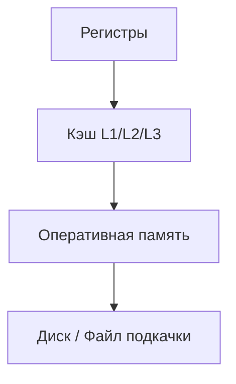
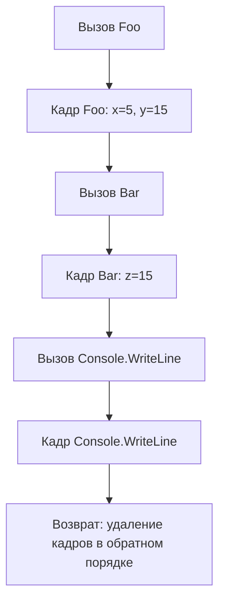
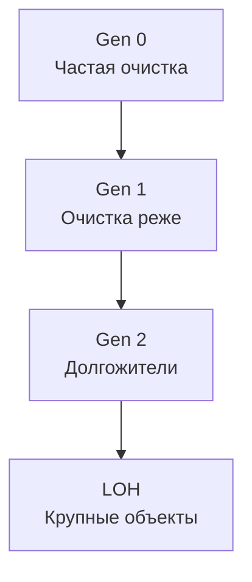

В этой статье будет говориться про устройство памяти в компьютере, а также о том, как код на C# эффективно управляет ею. Также затронем тему сборщика мусора, так как она достаточно сильно связана с темой данной статьи.

---

## Глава 1. Устройство памяти в компьютере

Как и во всех изобретениях человечества, так и в устройстве памяти все не так просто устроено, давайте разбираться.

Очевидно, что основная задача памяти - это хранение информации и ни для кого не секрет, что компьютер и все его составляющие понимают язык только 0 и 1, единицей которого является бит - минимальная единица измерения информации. 

Если рассуждать на чуть более абстрактном уровне, то информация бывает тоже разная, Например, мы можем определить какой информацией мы часто пользуемся, а какой редко. Так вот для эффективной работы с информации придумали целый ряд запоминающих устройств (ЗУ). Этот ряд укладывается в иерархическую структуру, каждая часть которой определяется скоростью и объемом.

- **Регистры**
- **Кэш-память (L1, L2, L3)**
- **Оперативная память (RAM)**
- **Диск (SSD/HDD)**



### Регистры

Ячейка памяти, которая является элементом, так называемой, сверхбыстрой оперативной памяти (СОЗУ), находящаяся внутри процессора. Это самая быстрая по доступу память в вычислительном устройстве, так как не происходит обращений к внешним ЗУ. Обычно в регистрах хранятся значения для вычислительных блоков процессора ALU/FPU/VPU. Доступ к таким данных происходит за один такт процессора.

>  **ALU (Arithmetic Logic Unit)** — арифметико-логическое устройство. Выполняет арифметические операции, такие как сложение, вычитание, умножение и деление, а также логические операции, например AND, OR, NOT и XOR. 
>  
>  **FPU (Floating Point Unit)** — блок, выполняющий операции с плавающей запятой.
>  
>  **VPU (Vector Processing Unit)** — модуль векторной обработки, который выполняет операции с векторными данными.

### Кэш-память

Она также находится внутри процессора и является СОЗУ, но имеет больший объем чем суммарный объем памяти регистров процессора (порядка нескольких КБ-МБ), но меньший чем оперативная память. Используется эта память для хранения копий часто используемых данных из основной памяти. Простыми словами чтобы не бегать за пределы процессора за данными, которые мы часто используем, мы кладем их в небольшую область рядом с процессором и берем от туда.

Сама кэш-память распределена на несколько уровней ***L1, L2, L3***. Отличаются они между собой скоростью доступа, объемом и расположением относительно процессора. 

- ***L1***. Самый быстрый и ближайший к ядру процессора уровень кэша. Имеет небольшой объем обычно около 10-100 КБ и разделен на 2 части: для инструкций и для данных.
- ***L2***. Имеет больший объем по сравнению с L1, но скорость ниже. Обычно L2 кэш выделяется для каждого ядра процессора отдельно для их автономной работы с данными.
- ***L3***. Самый медленный и самый большой по объему уровень кэша. Общий для всех ядер процессора и позволяет им обмениваться данными между собой.

Но есть подвох в этой системе. Допустим у нас есть 2 ядра:
 - ядро 1 загрузило переменную x в свой кэш;
 - ядро 2 тоже загрузило переменную x в кэш;
 - теперь оба ядра содержат копии одного и того же участка памяти RAM.
 
Вопрос, что будет если ядро 1 изменит x?
Кажется, что данные будут расходиться и программа упадет, и это могло быть так, если бы не существовала ***когерентность кэшей***. 

Прежде чем я расскажу, что это такое, нужно ввести понятие cache line. Это минимальная единица данных, которая может передаваться между основной памятью и кэш-памятью процессора.

#### Когерентность кэшей

Проще говоря, это набор правил, гарантирующих, что все ядра видят одно и то же значение переменной. Достигается это через протокол MESI и его расширения.

MESI - описывает 4 состояния кэша

- Modified - состояние когда ядро 1 изменила данные, а у остальных ядер они еще не изменились
- Exclusive - состояние, когда данные кэша полностью совпадают с RAM и больши нигде эта линия не закэширована
- Shared - состояние, когда данные кэша полностью совпадают с RAM, но линия закэширована у других ядер
- Invalidate - данные недействительны, нужно загрузить заново из RAM

1. Ядро 1 читает x → получает его в состоянии **E** (Exclusive).
2. Ядро 2 тоже читает x → оба переходят в **S** (Shared).
3. Ядро 1 записывает x → его состояние становится **M (Modified)**, а у ядра 2 строка x инвалидируется (**Invalidate**).
4. При следующем чтении ядро 2 обновит строку от ядра 1 или из RAM.

Когда ядро хочет изменить cache line, оно посылает запрос invalidate или share. другим ядрам. Другие ядра обновляют состояние своей линии. Это создает трафик когерентности.

### Оперативная память (RAM или Random Access Memory)

Это основное рабочее место программы. Ее объем измеряется в гигабайтах, но доступ медленнее, чем к кэшу. Главная особенность - это случайный доступ к памяти, что делает время доступа к любой ячейке примерно одинаковое. И в отличие от ПЗУ все данные исчезают при отключении питания.

Также в отличие от кэш-памяти, которая, в свою очередь, является SRAM (Static RAM), оперативная память - это модули DRAM (Dynamic RAM). Ячейкой DRAM является конденсатор + транзистор. Конденсатор кодирует 1 бит информации (есть заряд - 1, нет заряда - 0), а транзистор является подобием "двери" для доступа к заряду конденсатора.

С точки зрения программирования, для нас оперативная память - это место где расположены наши объекты, которые мы создаем. Причем эта область разделяется на ***стек*** и ***кучу***. Но об этом чуть позже.

### Диск (SSD/HDD)

Самый медленный уровень памяти, но и самый большой по объему. Данный вид памяти, в отличие от ОЗУ, является энергонезависимым. 

По внутреннему устройству HDD - это высокоточная «виниловая пластинка».
- **Пластины (platters)** — круглые диски, покрытые магнитным слоем. Данные хранятся в виде намагниченных участков.
- **Головка чтения/записи** — двигается над поверхностью пластины и изменяет/считывает магнитное состояние.

SSD не имеет механики. Это набор микросхем flash-памяти (NAND) + контроллер. SSD гораздо быстрее HDD по скорости чтения. 

#### Файл подкачки (page file / swap file)

Представьте ситуацию, мы открыли браузер с 100 вкладками, несколько мощных IDE и пару игр. По-хорошему у нас должна закончится RAM и приложения должны начать закрываться, но этого не происходит. Почему?

Для этого придумали файл подкачки. Я уже рассказывал про виртуальную память, но если вкратце, то это когда каждому приложению "кажется", что у него есть собственный большой кусок памяти. Так вот на самом деле та часть, которая часто используется, хранится в памяти, а то, что редко - "переезжает" на диск.

Файл подкачки как раз используется как расширение RAM, в который ОС выгружает редко используемые страницы памяти (кусочки по ~4 КБ)

С точки зрения программирования, нас интересует управляемая память, а именно ***стек и куча***.

---

## Глава 2. Стек

**Стек (stack)** — это область памяти, работающая по принципу **LIFO (Last In – First Out)**: последним положили — первым достали.  

В стеке хранится:  
- адрес возврата после вызова метода;  
- значения параметров метода;  
- локальные переменные;  
- указатели на другие структуры данных.  

Каждый вызов метода создает в стеке **кадр стека (stack frame)**.  

```csharp
void Foo(int x)
{
    int y = x + 10;
    Bar(y);
}

void Bar(int z)
{
    Console.WriteLine(z);
}

Foo(5);
```

  
Что произойдет:  

1. Вызов `Foo(5)` → в стек кладется параметр `x = 5`.  
2. Создается локальная переменная `y = 15`.  
3. Вызов `Bar(y)` → в стек добавляется новый кадр с `z = 15`.  
4. Внутри `Bar` вызывается `Console.WriteLine`, добавляется новый кадр.  
5. По завершении `Console.WriteLine` → кадр удаляется.  
6. Возврат к `Bar`, затем к `Foo`, стек очищается.  



  
 **Особенности стека:**
- очень быстрый доступ (работа через указатель стека);
- память освобождается автоматически при выходе из метода;
- размер ограничен (по умолчанию ~1 МБ на поток в .NET);
- рекурсия может привести к ошибке **StackOverflowException**.  

---

## Глава 3. Куча

**Куча (heap)** — область памяти, где хранятся объекты, созданные динамически с помощью ключевого слова `new`.  

  В отличие от стека, где данные исчезают при выходе из метода, объекты в куче живут, пока на них есть ссылки.  

```csharp
class Person
{
    public string Name;
}

void Test()
{
    var p = new Person(); // объект в куче
    p.Name = "Alice";     // поле хранится в куче
}
```

Здесь переменная `p` — **ссылка в стеке**, а сам объект `Person` и его поле `Name` — в куче.


### Отличие **struct** и **class**

- `struct` хранится в стеке (если это локальная переменная).  
- `class` всегда создается в куче.  

```csharp
struct Point { public int X, Y; }
class PointClass { public int X, Y; }

var s = new Point();      // в стеке
var c = new PointClass(); // в куче
```

### Large Object Heap (LOH)

В .NET объекты размером больше **85 КБ** попадают в отдельную область — **Large Object Heap**.  

Там хранятся, например, большие массивы. Очистка этой области происходит реже, а фрагментация памяти более ощутимая.  

---

## Глава 4. Сборщик мусора

Чтобы не писать вручную `free()` или `delete`, как в C++, в .NET есть **Garbage Collector (GC)**. Он автоматически освобождает память от объектов, на которые больше нет ссылок.  

### Поколения GC

- **Gen 0.** Молодые объекты (например, локальные переменные). Очистка происходит часто.  

- **Gen 1.** Буфер между молодыми и долгоживущими объектами.  

- **Gen 2.** Долгоживущие объекты (синглтоны, кэши, статические поля). Очистка происходит редко.  

- **LOH (Large Object Heap).** Крупные объекты, отдельная область.  

  



  

### Финализация и Dispose

Некоторые объекты используют **неуправляемые ресурсы** (например, файловые дескрипторы или соединения с БД).  

  

Для их корректного освобождения существует:  

- **Finalizer (~Destructor)** — вызывается GC перед удалением объекта.  

- **IDisposable / using** — явное освобождение ресурсов:

  

```csharp

using (var fs = new FileStream("data.txt", FileMode.Open))

{

    // работаем с файлом

} // здесь вызывается Dispose()

```

  

### Workstation GC и Server GC

- **Workstation GC** — оптимизирован для приложений с UI.  

- **Server GC** — для многопоточных серверных приложений, использует несколько потоков при очистке.  

  

---

  

## Глава 5. Заключение

  

| Раздел | Ключевые моменты |

|--------|------------------|

| **1. Устройство памяти** | - Память организована иерархически (регистры → кэш → RAM → диск). |

| **2. Стек** | - Хранение локальных данных и вызовов.<br/>- Быстрый доступ, автоматическое освобождение.<br/>- Ограниченный размер, риск StackOverflow. |

| **3. Куча** | - Хранение объектов (`class`).<br/>- Живут до тех пор, пока на них есть ссылки.<br/>- Существуют LOH для больших объектов. |

| **4. Сборщик мусора** | - Поколения Gen 0/1/2 + LOH.<br/>- Автоматическое освобождение памяти.<br/>- Поддержка Dispose для неуправляемых ресурсов. |

  

---
