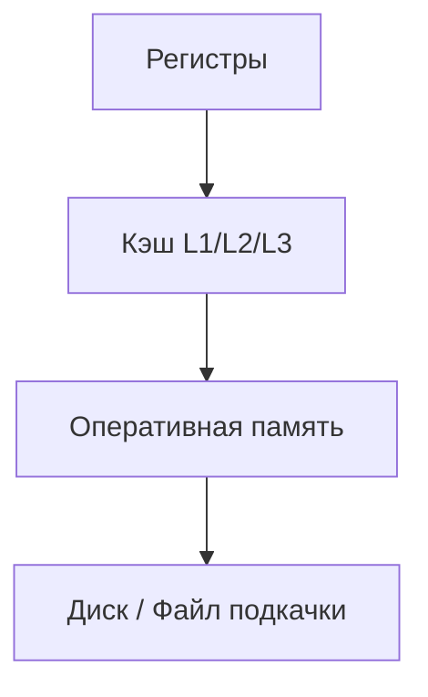
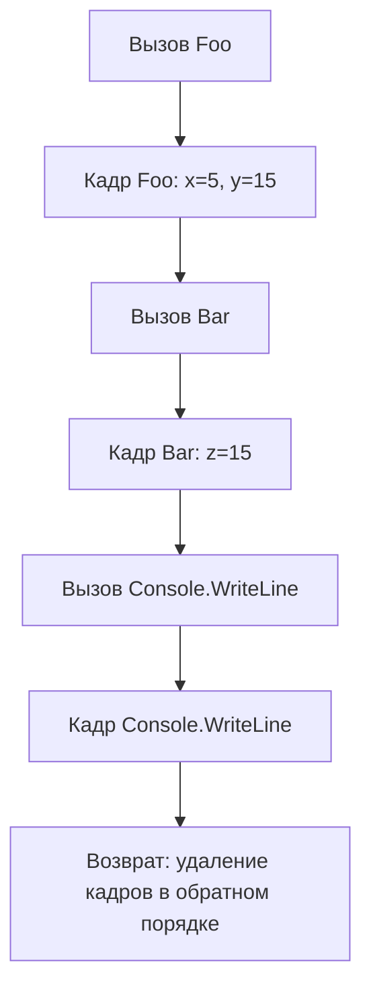
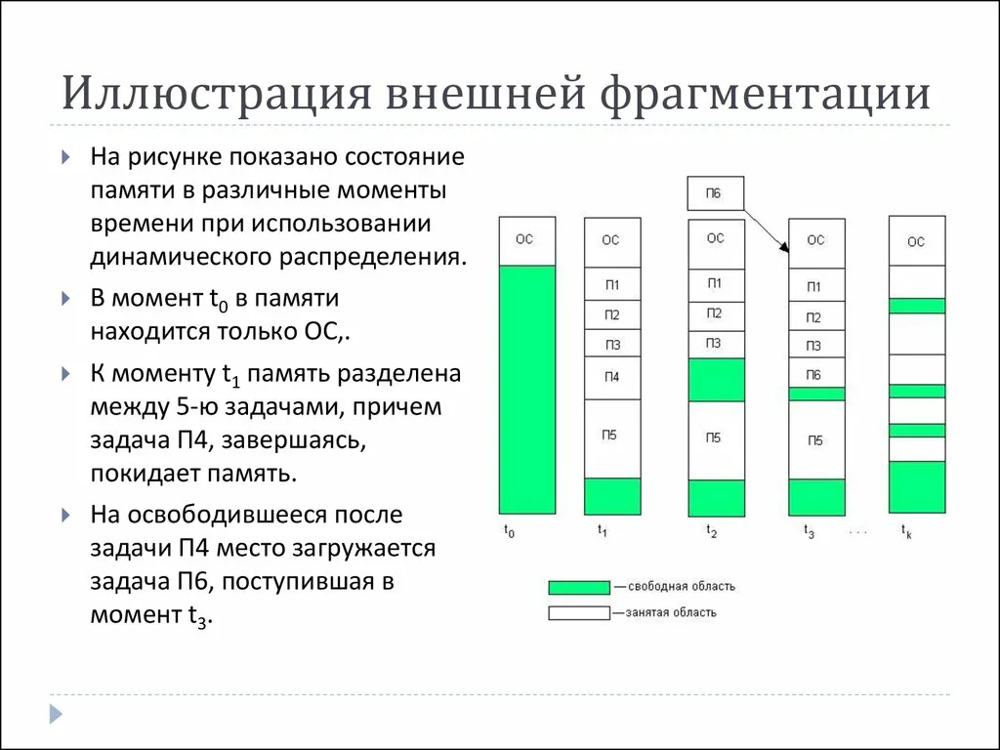

В этой статье будет говориться про устройство памяти в компьютере, а также о том, как код на C# эффективно управляет ею. Также затронем тему сборщика мусора, так как она достаточно сильно связана с темой данной статьи.

---

## Глава 1. Устройство памяти в компьютере

Как и во всех изобретениях человечества, так и в устройстве памяти все не так просто устроено, давайте разбираться.

Очевидно, что основная задача памяти - это хранение информации и ни для кого не секрет, что компьютер и все его составляющие понимают язык только 0 и 1, единицей которого является бит - минимальная единица измерения информации. 

Если рассуждать на чуть более абстрактном уровне, то информация бывает тоже разная, Например, мы можем определить какой информацией мы часто пользуемся, а какой редко. Так вот для эффективной работы с информации придумали целый ряд запоминающих устройств (ЗУ). Этот ряд укладывается в иерархическую структуру, каждая часть которой определяется скоростью и объемом.

- **Регистры**
- **Кэш-память (L1, L2, L3)**
- **Оперативная память (RAM)**
- **Диск (SSD/HDD)**



### Регистры

Ячейка памяти, которая является элементом, так называемой, сверхбыстрой оперативной памяти (СОЗУ), находящаяся внутри процессора. Это самая быстрая по доступу память в вычислительном устройстве, так как не происходит обращений к внешним ЗУ. Обычно в регистрах хранятся значения для вычислительных блоков процессора ALU/FPU/VPU. Доступ к таким данных происходит за один такт процессора.

>  **ALU (Arithmetic Logic Unit)** — арифметико-логическое устройство. Выполняет арифметические операции, такие как сложение, вычитание, умножение и деление, а также логические операции, например AND, OR, NOT и XOR. 
>  
>  **FPU (Floating Point Unit)** — блок, выполняющий операции с плавающей запятой.
>  
>  **VPU (Vector Processing Unit)** — модуль векторной обработки, который выполняет операции с векторными данными.

### Кэш-память

Она также находится внутри процессора и является СОЗУ, но имеет больший объем чем суммарный объем памяти регистров процессора (порядка нескольких КБ-МБ), но меньший чем оперативная память. Используется эта память для хранения копий часто используемых данных из основной памяти. Простыми словами чтобы не бегать за пределы процессора за данными, которые мы часто используем, мы кладем их в небольшую область рядом с процессором и берем от туда.

Сама кэш-память распределена на несколько уровней ***L1, L2, L3***. Отличаются они между собой скоростью доступа, объемом и расположением относительно процессора. 

- ***L1***. Самый быстрый и ближайший к ядру процессора уровень кэша. Имеет небольшой объем обычно около 10-100 КБ и разделен на 2 части: для инструкций и для данных.
- ***L2***. Имеет больший объем по сравнению с L1, но скорость ниже. Обычно L2 кэш выделяется для каждого ядра процессора отдельно для их автономной работы с данными.
- ***L3***. Самый медленный и самый большой по объему уровень кэша. Общий для всех ядер процессора и позволяет им обмениваться данными между собой.

Но есть подвох в этой системе. Допустим у нас есть 2 ядра:
 - ядро 1 загрузило переменную x в свой кэш;
 - ядро 2 тоже загрузило переменную x в кэш;
 - теперь оба ядра содержат копии одного и того же участка памяти RAM.
 
Вопрос, что будет если ядро 1 изменит x?
Кажется, что данные будут расходиться и программа упадет, и это могло быть так, если бы не существовала ***когерентность кэшей***. 

Прежде чем я расскажу, что это такое, нужно ввести понятие cache line. Это минимальная единица данных, которая может передаваться между основной памятью и кэш-памятью процессора.

#### Когерентность кэшей

Проще говоря, это набор правил, гарантирующих, что все ядра видят одно и то же значение переменной. Достигается это через протокол MESI и его расширения.

MESI - описывает 4 состояния кэша

- Modified - состояние когда ядро 1 изменила данные, а у остальных ядер они еще не изменились
- Exclusive - состояние, когда данные кэша полностью совпадают с RAM и больши нигде эта линия не закэширована
- Shared - состояние, когда данные кэша полностью совпадают с RAM, но линия закэширована у других ядер
- Invalidate - данные недействительны, нужно загрузить заново из RAM

1. Ядро 1 читает x → получает его в состоянии **E** (Exclusive).
2. Ядро 2 тоже читает x → оба переходят в **S** (Shared).
3. Ядро 1 записывает x → его состояние становится **M (Modified)**, а у ядра 2 строка x инвалидируется (**Invalidate**).
4. При следующем чтении ядро 2 обновит строку от ядра 1 или из RAM.

Когда ядро хочет изменить cache line, оно посылает запрос invalidate или share. другим ядрам. Другие ядра обновляют состояние своей линии. Это создает трафик когерентности.

### Оперативная память (RAM или Random Access Memory)

Это основное рабочее место программы. Ее объем измеряется в гигабайтах, но доступ медленнее, чем к кэшу. Главная особенность - это случайный доступ к памяти, что делает время доступа к любой ячейке примерно одинаковое. И в отличие от ПЗУ все данные исчезают при отключении питания.

Также в отличие от кэш-памяти, которая, в свою очередь, является SRAM (Static RAM), оперативная память - это модули DRAM (Dynamic RAM). Ячейкой DRAM является конденсатор + транзистор. Конденсатор кодирует 1 бит информации (есть заряд - 1, нет заряда - 0), а транзистор является подобием "двери" для доступа к заряду конденсатора.

С точки зрения программирования, для нас оперативная память - это место где расположены наши объекты, которые мы создаем. Причем эта область разделяется на ***стек*** и ***кучу***. Но об этом чуть позже.

### Диск (SSD/HDD)

Самый медленный уровень памяти, но и самый большой по объему. Данный вид памяти, в отличие от ОЗУ, является энергонезависимым. 

По внутреннему устройству HDD - это высокоточная «виниловая пластинка».
- **Пластины (platters)** — круглые диски, покрытые магнитным слоем. Данные хранятся в виде намагниченных участков.
- **Головка чтения/записи** — двигается над поверхностью пластины и изменяет/считывает магнитное состояние.

SSD не имеет механики. Это набор микросхем flash-памяти (NAND) + контроллер. SSD гораздо быстрее HDD по скорости чтения. 

#### Файл подкачки (page file / swap file)

Представьте ситуацию, мы открыли браузер с 100 вкладками, несколько мощных IDE и пару игр. По-хорошему у нас должна закончится RAM и приложения должны начать закрываться, но этого не происходит. Почему?

Для этого придумали файл подкачки. Я уже рассказывал про виртуальную память, но если вкратце, то это когда каждому приложению "кажется", что у него есть собственный большой кусок памяти. Так вот на самом деле та часть, которая часто используется, хранится в памяти, а то, что редко - "переезжает" на диск.

Файл подкачки как раз используется как расширение RAM, в который ОС выгружает редко используемые страницы памяти (кусочки по ~4 КБ)

*Мы поговорили о том, какие виды памяти бывают и как она работает. Теперь перейдем к тому, как это отражается в высокоуровневом языке C#.*

---

## Глава 2. Стек

Это область памяти, которая устроена достаточно просто и эффективно. Работает она по принципу LIFO (Last In First Out), 
это как колода карт, из которой берут всегда карту сверху, а чтобы взять вторую сверху, нужно сначала взять первую. Можно также сравнить с магазином огнестрельного оружия, где патроны находятся друг под другом и извлекаются по очереди, начиная сверху.

Стек зачастую реализуется в виде однонаправленного списка, где каждый элемент хранит помимо своей информации указатель на следующий элемент стека. Но также существует реализация в виде ондомерного массива с упорядоченными адресами, при условии, что каждый элемент занимает в памяти фиксированный размер слов. Таким образом, отпадает необходимость хранить ссылку на следующий элемент, что экономит память. 

>  **Машинное слово** - это единица данных, выбранная под конкретную архитектуру. То есть фрагмент данных. обрабатываемый как единое целое с помощью набора команд или аппаратного обеспечения процессора.

Указатель стека (Stack Pointer, SP) - это регистр, который содержит адрес вершины стека. Он используется для проведения операций со стеком.

Как правило, со стеком возможны 3 операции: 
- добавить элемент в стек (push)
- достать элемента из стека (pop)
- считать головной элемент (peek)

Стек имеет ограниченный размер (порядка ~1 МБ) на каждый поток. Обычно в нем хранятся локальные переменные простых типов данных (int, double, float, struct). Когда мы вызываем метод, создается **кадр стека**, содержащий параметры, локальные переменные, адрес возврата, указатели на другие структуры данных.


```csharp
void Foo(int x)
{
    int y = x + 10;
    Bar(y);
}

void Bar(int z)
{
    Console.WriteLine(z);
}

Foo(5);
```

  
Что произойдет:  

1. Вызов `Foo(5)` → в стек кладется параметр `x = 5`.  
2. Создается локальная переменная `y = 15`.  
3. Вызов `Bar(y)` → в стек добавляется новый кадр с `z = 15`. 
4. Внутри `Bar` вызывается `Console.WriteLine`, добавляется новый кадр.  
5. По завершении `Console.WriteLine` → кадр удаляется.  
6. Возврат к `Bar`, затем к `Foo`, стек очищается.  

5 и 6 пункты еще называют *раскруткой стека*.



Если же мы будем использовать рекурсию для решения какой-либо задачи и забудем написать уловие выхода, то мы получим исключение **StackOverflowException**.  

```csharp
public int Foo(int x)
{
	/* Условие выхода 
	 * if (x == 0)
	 *     return 1;
	 */
	return x * Foo(x - 1);
}

Foo(5); // -> StackOverflowException
```

---
## Глава 3. Куча

Если у стека достаточно строго с выделением памяти, ограниченный размер и достаточно шустрая работа, то у кучи все наоборот. Куча имеет больший объем, ограниченный в основном размером RAM. Элементы в ней располагаются в произвольном порядке, а доступ к ним осуществляется через адреса. Когда нам нужно положить объект в кучу, для него выделяется непрерывный блок в свободной памяти. 

Выделяется память с помощью функций подобных ```malloc()```, которые используют системный вызов (обращаются к ОС), при котором происходит переключение контекста из пространства пользователя в пространство ядра ОС и обратно. Чтобы при каждом выделении не дергать ОС (потому что это медленно) придумали следующую систему. Делать один раз системный вызов для выделения сразу большого объема памяти, а дальше хранить информацию о свободных и занятых областях кучи. 

#### Фрагментация

Иногда может получаться так, что между блоками памяти появляются небольшие пробелы, из-за чего сложно выделить большой непрерывный блок памяти.
Существует 2 вида фрагментации: ***внешняя и внутренняя***.

Внешняя - небольшие блоки свободной памяти разделяются выделенной памятью.
Внутренняя - выделился блок большей памяти, чем требуется объекту, в результате часть памяти занята и не используется.




В куче располагаются **объекты ссылочных типов**, то есть:

- классы (class),
    
- массивы (int[], string[]),
    
- строки (string),
    
- делегаты и лямбда-выражения,
    
- экземпляры анонимных и динамических типов.

``` csharp
class Person
{
    public string Name;
    public int Age;
}

void Example()
{
    Person p = new Person(); // p - стек, Person - куча
    p.Name = "Vadim"; // Name - куча
    p.Age = 30; // Age - куча
}
```

#### LOH (Large Object Heap)

Это специальная область памяти в .NET, в которую сборщик мусора (GC) помещает большие объекты - свыше 85.000 байт. Это могут быть большие массивы, строки. Очистка этих объектов происходит только во втором поколении GC.

---
## Глава 4. Finalize & IDisposable

Иногда некоторые объекты владеют неуправляемыми ресурсами, например, файловыми дескрипторами, сетевыми соединениями, хендлами окон - всем, что обращается к API ОС. Сборщик мусора не знает как освобождать эти ресурсы, поэтому для грамотной работы с ними придумали интерфейс IDisposable, который реализует всего один метод 
```Dispose()```. 

```csharp
Test();

void Test()
{
    Person? tom = null;
    try
    {
        tom = new Person("Tom");
    }
    finally
    {
        tom?.Dispose();
    }
}

public class Person : IDisposable
{
    public string Name { get;}
    public Person(string name) => Name = name;

    public void Dispose()
    {
        Console.WriteLine($"{Name} has been disposed");
    }
}
```

В методе ```Dispose()``` описывается логика освобождения ресурсов. Программист должен явно вызывать этот метод. Но может получится так, что он забудет его вызвать. Для этого следует использовать дополнительно конструкцию Finalize, которая выглядит следующим образом

``` csharp
protected override void Finalize()
{
	try 
	{
		// описание деструктора
	}
	finally
	{
		base.Finalize();
	}
}
```

Метод ```Finalize()``` определен в базовом для всех типов классе Object, но этот метод нельзя так просто переопределить, поэтому фактическая его реализация происходит через создание деструктора.

``` csharp
class Person 
{
	public srting Name { get; }
	public Person(string Name) => Name = name;
	
	~Person()
	{
		// описание деструктора
	}
}
```

Компилятор сам переводит деструктор в первую форму (```Finalize()```).

Под капотом это работает так, если у объекта есть метод ```Finalize()```, то указатель на него сохраняется в специальной таблице, которая называется ***очередь финализации***. 

Для грамотного определения IDisposable Microsoft предлагает использовать следующий шаблон.

``` csharp
public class MyClass : IDisposable
{
	private bool disposed = false;
	
	public void Dispose()
	{
		Dispose(true);
		GC.SuppressFinalize(this);
	}
	
	protected void Dispose(bool disposing)
	{
		if (disposed) return;
		if (disposing)
		{
			// очистка управляемых ресурсов
		}
		// очистка неуправляемых ресурсов
		disposed = true;
	}
	
	~MyClass()
	{
		Dispose(false);
	}
}
```

## Заключение

**Глава 1.**
- Что такое память и ее основные виды?
- Какая память является самой быстрой и самой медленной?
- Что такое когерентность кэшей?
- Где хранятся наши объекты?
- Почему не заканчивается оперативная память?

**Глава 2.**
- Как устроен стек?
- Почему возникает исключение StackOverFlow?

**Глава 3.**
 - Что такое куча и какие проблемы у нее есть?
 - Что такое LOH?

**Глава 4.**
 - Зачем нам деструкторы в C#?
 - Что такое IDisposable?
