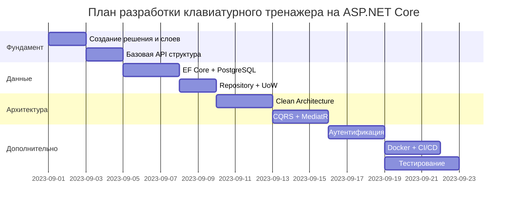

### План изучения и реализации (с нуля до production-ready)



### Детальный пошаговый план:

#### 1. Фундамент (Неделя 1)
**Технологии:** ASP.NET Core Web API, Swagger
- Создайте решение с проектами:
  ```
  KeyboardTrainer.API (Web API)
  KeyboardTrainer.Application
  KeyboardTrainer.Domain
  KeyboardTrainer.Infrastructure
  ```
- Настройте базовый контроллер:
  ```csharp
  [ApiController]
  [Route("api/[controller]")]
  public class TextsController : ControllerBase
  {
      [HttpGet]
      public IActionResult GetTexts()
      {
          return Ok(new[] { "Text 1", "Text 2" });
      }
  }
  ```
- Подключите Swagger для тестирования API

#### 2. Работа с данными (Неделя 2)
**Технологии:** Entity Framework Core, PostgreSQL, Repository Pattern
- Добавьте в Infrastructure:
  ```bash
  dotnet add package Npgsql.EntityFrameworkCore.PostgreSQL
  dotnet add package Microsoft.EntityFrameworkCore.Design
  ```
- Создайте DbContext и модели:
  ```csharp
  public class AppDbContext : DbContext
  {
      public DbSet<Text> Texts { get; set; }
      // Конструктор и конфигурация
  }
  
  public class Text
  {
      public int Id { get; set; }
      public string Content { get; set; }
      public string Language { get; set; }
  }
  ```
- Реализуйте Generic Repository:
  ```csharp
  public interface IRepository<T> where T : class
  {
      Task<T> GetByIdAsync(int id);
      Task<IReadOnlyList<T>> GetAllAsync();
      // ...
  }
  ```

#### 3. Чистая архитектура (Неделя 3)
**Технологии:** Dependency Injection, Interfaces
- Настройте зависимости в Program.cs:
  ```csharp
  builder.Services.AddScoped(typeof(IRepository<>), typeof(Repository<>));
  builder.Services.AddDbContext<AppDbContext>(options => 
      options.UseNpgsql(Configuration.GetConnectionString("DefaultConnection")));
  ```
- Перенесите бизнес-логику в Application слой:
  ```csharp
  // Application/Services/TextService.cs
  public class TextService
  {
      private readonly IRepository<Text> _textRepository;
      
      public TextService(IRepository<Text> textRepository)
      {
          _textRepository = textRepository;
      }
      
      public async Task<IEnumerable<Text>> GetAllTexts()
      {
          return await _textRepository.GetAllAsync();
      }
  }
  ```

#### 4. CQRS и MediatR (Неделя 4)
**Технологии:** MediatR, AutoMapper
- Установите пакеты:
  ```bash
  dotnet add package MediatR
  dotnet add package AutoMapper.Extensions.Microsoft.DependencyInjection
  ```
- Реализуйте CQRS:
  ```csharp
  // Features/Texts/Queries/GetTextsQuery.cs
  public record GetTextsQuery : IRequest<IEnumerable<TextDto>>;

  public class GetTextsQueryHandler : IRequestHandler<GetTextsQuery, IEnumerable<TextDto>>
  {
      private readonly ITextRepository _repository;
      private readonly IMapper _mapper;
      
      public GetTextsQueryHandler(/*...*/)
      {
          // ...
      }
      
      public async Task<IEnumerable<TextDto>> Handle(GetTextsQuery request, CancellationToken token)
      {
          var texts = await _repository.GetAllAsync();
          return _mapper.Map<IEnumerable<TextDto>>(texts);
      }
  }
  ```
- В контроллере:
  ```csharp
  [HttpGet]
  public async Task<IActionResult> GetTexts()
  {
      var result = await _mediator.Send(new GetTextsQuery());
      return Ok(result);
  }
  ```

#### 5. Аутентификация и авторизация (Неделя 5)
**Технологии:** JWT, ASP.NET Core Identity
- Настройте аутентификацию:
  ```csharp
  builder.Services.AddAuthentication(JwtBearerDefaults.AuthenticationScheme)
      .AddJwtBearer(options => 
      {
          options.TokenValidationParameters = new TokenValidationParameters
          {
              ValidateIssuer = true,
              ValidIssuer = builder.Configuration["Jwt:Issuer"],
              ValidateAudience = true,
              ValidAudience = builder.Configuration["Jwt:Audience"],
              ValidateLifetime = true,
              IssuerSigningKey = new SymmetricSecurityKey(
                  Encoding.UTF8.GetBytes(builder.Configuration["Jwt:Key"])),
              ValidateIssuerSigningKey = true,
          };
      });
  ```
- Реализуйте эндпоинты регистрации/входа с использованием CQRS

#### 6. Тестирование (Параллельно с недели 3)
**Технологии:** xUnit, Moq, Testcontainers
- Пример unit-теста:
  ```csharp
  [Fact]
  public async Task Handle_GetTextsQuery_ReturnsTexts()
  {
      // Arrange
      var mockRepo = new Mock<ITextRepository>();
      mockRepo.Setup(repo => repo.GetAllAsync())
          .ReturnsAsync(new List<Text> { new Text() });
      
      var handler = new GetTextsQueryHandler(mockRepo.Object, _mapper);
      
      // Act
      var result = await handler.Handle(new GetTextsQuery());
      
      // Assert
      Assert.Single(result);
  }
  ```
- Интеграционные тесты с Testcontainers для PostgreSQL

#### 7. Docker и CI/CD (Неделя 6)
**Технологии:** Docker, GitLab CI
- Dockerfile для API:
  ```dockerfile
  FROM mcr.microsoft.com/dotnet/sdk:8.0 AS build
  WORKDIR /src
  COPY . .
  RUN dotnet restore
  RUN dotnet publish -c Release -o /app

  FROM mcr.microsoft.com/dotnet/aspnet:8.0
  WORKDIR /app
  COPY --from=build /app .
  ENTRYPOINT ["dotnet", "KeyboardTrainer.API.dll"]
  ```
- .gitlab-ci.yml:
  ```yaml
  stages:
    - build
    - test
    - deploy

  build:
    stage: build
    image: mcr.microsoft.com/dotnet/sdk:8.0
    script:
      - dotnet restore
      - dotnet build --no-restore

  test:
    stage: test
    image: mcr.microsoft.com/dotnet/sdk:8.0
    services:
      - postgres:latest
    script:
      - dotnet test
  ```

### 📚 Ресурсы для каждого этапа

1. **Фундамент:**
   - [Документация ASP.NET Core](https://learn.microsoft.com/aspnet/core)
   - [Swagger для ASP.NET Core](https://learn.microsoft.com/aspnet/core/tutorials/web-api-help-pages)

2. **EF Core:**
   - [Entity Framework Core в документации](https://learn.microsoft.com/ef/core)
   - [EF Core с PostgreSQL](https://www.npgsql.org/efcore/)

3. **Архитектура:**
   - [Clean Architecture с .NET](https://github.com/ardalis/CleanArchitecture)
   - [Рекомендации по проектированию .NET приложений](https://learn.microsoft.com/dotnet/architecture/)

4. **CQRS/MediatR:**
   - [Implementing CQRS в ASP.NET Core](https://code-maze.com/cqrs-mediatr-aspnet-core/)
   - [MediatR Wiki](https://github.com/jbogard/MediatR/wiki)

5. **Безопасность:**
   - [Аутентификация в ASP.NET Core](https://learn.microsoft.com/aspnet/core/security/)
   - [JWT Authentication Tutorial](https://jasonwatmore.com/net-8-jwt-authentication-tutorial)

6. **Тестирование:**
   - [Тестирование в .NET](https://learn.microsoft.com/dotnet/core/testing/)
   - [Testcontainers для .NET](https://dotnet.testcontainers.org/)

7. **DevOps:**
   - [Docker для .NET приложений](https://learn.microsoft.com/dotnet/core/docker/)
   - [GitLab CI/CD для .NET](https://docs.gitlab.com/ee/ci/examples/dotnet.html)

### 🛠 Важные советы при реализации

1. **Постепенное внедрение:**
   - Начинайте с простой реализации без CQRS
   - Вводите MediatR после настройки базового функционала
   - Рефакторите контроллеры постепенно

2. **Версионирование API:**
   ```csharp
   services.AddApiVersioning(options => {
       options.DefaultApiVersion = new ApiVersion(1,0);
       options.ReportApiVersions = true;
   });
   ```

3. **Обработка ошибок:**
   - Создайте middleware для обработки исключений
   - Используйте ProblemDetails для стандартизации ошибок

4. **Логирование:**
   - Используйте ILogger с разными уровнями логирования
   - Настройте Serilog или NLog для продвинутого логирования

5. **Конфигурация:**
   - Используйте appsettings.json с разными средами
   - Храните секреты в менеджере секретов или в Azure Key Vault

6. **Миграции:**
   - Создавайте миграции при изменении моделей:
   ```bash
   dotnet ef migrations add InitialCreate
   dotnet ef database update
   ```

7. **Оптимизация производительности:**
   - Используйте AsNoTracking() для read-only операций
   - Реализуйте пагинацию для больших коллекций
   - Используйте кэширование для часто запрашиваемых данных

Этот план позволяет вам добавлять технологии последовательно, сразу применяя их на практике в вашем проекте. Каждый следующий этап логично вытекает из предыдущего, что минимизирует конфликты и позволяет осваивать концепции постепенно. Удачи в реализации! 


Отличный подход! Стремление избежать "первой версии" и сразу строить проект по лучшим практикам — признак зрелого разработчика. Вот что нужно изучить перед стартом, чтобы ваш ASP.NET Core проект сразу был production-ready:

**1. Основы архитектуры (Критически важно!)**
- **Clean Architecture / Onion Architecture:**
  - Книга Роберта Мартина "Чистая архитектура"
  - Статья Microsoft: [Clean Architecture with ASP.NET Core](https://learn.microsoft.com/en-us/dotnet/architecture/modern-web-apps-azure/common-web-application-architectures#clean-architecture)
  - Репозиторий-пример: [ardalis/CleanArchitecture](https://github.com/ardalis/CleanArchitecture)
- **Принципы SOLID** (особенно Dependency Inversion)
- **Domain-Driven Design (DDD)** основы:
  - Тактические паттерны: Entity, Value Object, Aggregate
  - Стратегическое проектирование: Bounded Context

**2. Ключевые паттерны для ASP.NET Core**
- **Слоистая архитектура:**
  ```plaintext
  Presentation Layer (API)
  ↓
  Application Layer (Use Cases)
  ↓
  Domain Layer (Business Logic)
  ↓
  Infrastructure Layer (DB, External Services)
  ```
- **CQRS (Command Query Responsibility Segregation):**
  - Отделение операций записи (Commands) от чтения (Queries)
  - Библиотека MediatR для реализации
- **Repository Pattern** и **Unit of Work**:
  - Правильная абстракция доступа к данным
  - Сочетание с EF Core

**3. Работа с данными (EF Core Best Practices)**
- **Code-First подход** с миграциями
- **Fluent API** вместо data annotations
- **Оптимизация запросов:**
  - AsNoTracking()
  - Select() для проекций
  - Avoid N+1 queries
- **Шаблон Repository** + **Specification Pattern**
- **Dapper** для сложных запросов

**4. Современные подходы к API**
- **Minimal APIs** для простых endpoints
- **Controller-based APIs** для сложной логики
- **RESTful design principles**
- **Versioning API** (используйте библиотеку `Microsoft.AspNetCore.Mvc.Versioning`)
- **Документирование через Swagger/OpenAPI**

**5. Безопасность и валидация**
- **Аутентификация/авторизация:**
  - JWT Bearer Authentication
  - OAuth 2.0 / OpenID Connect
  - Policy-based authorization
- **Валидация с FluentValidation**
- **Защита от уязвимостей:**
  - CSRF
  - XSS
  - SQL Injection
  - Подробнее: [OWASP Top 10](https://owasp.org/www-project-top-ten/)

**6. Тестирование (Обязательно!)**
- **Unit-тесты:**
  - xUnit/NUnit
  - Moq/NSubstitute
- **Integration-тесты:**
  - WebApplicationFactory
  - Testcontainers для БД
- **End-to-end тесты** (Playwright, Selenium)

**7. Производительность и масштабируемость**
- **Кэширование:**
  - In-memory (IMemoryCache)
  - Распределенное (Redis)
- **Асинхронное программирование** (async/await везде)
- **Response compression**
- **Health Checks**
- **Horizonzal scaling стратегии**

**8. DevOps практики**
- **Контейнеризация с Docker**
- **CI/CD пайплайны:**
  - GitHub Actions
  - GitLab CI
  - Azure DevOps
- **Конфигурация:**
  - Environment variables
  - Azure Key Vault
  - AppSettings.json

**Практический план действий перед стартом проекта:**

1. **Прототипируйте архитектуру:**
   ```mermaid
   graph TD
     A[API Layer] --> B[Application Layer]
     B --> C[Domain Layer]
     B --> D[Infrastructure Layer]
     D --> E[Database]
     D --> F[External Services]
   ```

2. **Настройте базовый шаблон:**
   - Создайте solution с проектами:
     - `YourProject.Api` (ASP.NET Core Web API)
     - `YourProject.Application` (Class Library)
     - `YourProject.Domain` (Class Library)
     - `YourProject.Infrastructure` (Class Library)
     - `YourProject.Tests` (xUnit)

3. **Конфигурируйте зависимости:**
   ```csharp
   // Program.cs
   builder.Services
       .AddApplication()
       .AddInfrastructure(builder.Configuration);
   ```

4. **Реализуйте базовые абстракции:**
   - Generic Repository
   - Specification Pattern
   - CQRS Handlers
   - Exception Middleware

5. **Настройте инфраструктуру:**
   - EF Core Context
   - Миграции
   - Dockerfile
   - CI/CD конфигурацию

**Ключевые книги и ресурсы:**

1. Книга: "ASP.NET Core in Action" (Andrew Lock)
2. Книга: "Clean Architecture" (Robert C. Martin)
3. Курс: [Microservices with ASP.NET Core](https://www.pluralsight.com/paths/asp-dot-net-core-microservices)
4. Документация: [Microsoft Learn - ASP.NET Core](https://learn.microsoft.com/en-us/aspnet/core/)
5. Репозитории с лучшими практиками:
   - [eShopOnWeb](https://github.com/dotnet-architecture/eShopOnWeb)
   - [NorthwindTraders](https://github.com/jasontaylordev/NorthwindTraders)

**Что делать во время разработки:**
- Всегда пишите тесты ДО реализации (TDD где возможно)
- Используйте статический анализ (SonarQube, Roslyn Analyzers)
- Настройте линтеры (EditorConfig)
- Регулярно делайте рефакторинг
- Документируйте архитектурные решения (ADR - Architecture Decision Records)

Ваш опыт с MVVM в WPF прекрасно ложится на backend-разработку. Основные принципы те же:
- Разделение ответственности
- Инверсия зависимостей
- Слабая связанность
- Тестируемость

Главное отличие — вместо Binding и ViewModel вы будете работать с:
- HTTP Request/Response pipeline
- Бизнес-логикой в Domain Layer
- Сложными сценариями работы с данными

Начните с небольшого проекта, но сразу применяя эти практики. Например, реализуйте:
1. Authentication Service
2. CRUD для одной сущности
3. Отчет с агрегацией данных
4. Интеграцию с внешним API

И помните: лучше начать с "чистой" архитектуры и упростить, чем потом рефакторить "большой ком"!