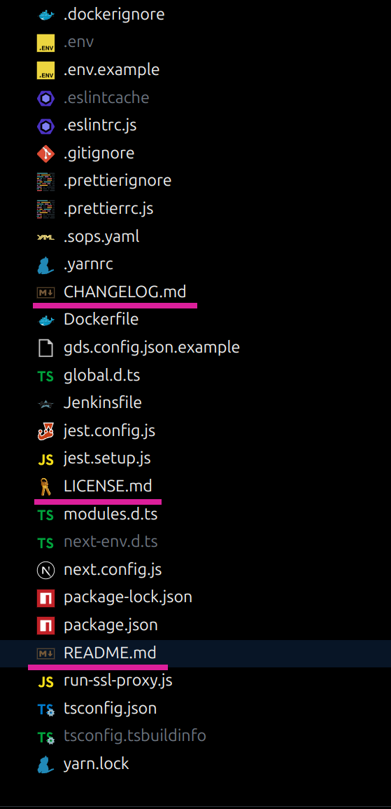
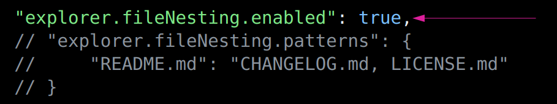
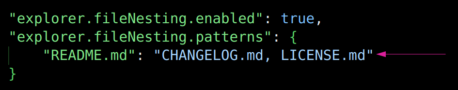
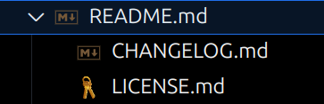

Практически на любом проекте есть целый перечень файлов, которые для самого проекта необходимы, но для повседневной работы не нужны. Такие файлы, как правило, болтаются в корне проекта и нагружают и без того немаленькое дерево файлов.

Избавиться от этих файлов в дереве можно, разбив их не тематические группы.

Рассмотрим дерево фронтового проекта:

Видим, что различных файлов, например каких-то конфигов, MD, артефактов сборки и т.п. достаточно много, чтобы они могли занимать целый экран!

В такой ситуации, а также в ряде других, где это покажется целесообразным, можно облегчить свою жизнь при помощи настройки `explorer.fileNesting` для всего VSCode или для какого-то отдельного проекта в частности.

Посмотрим на то, как это работает на примере группировки MD файлов.
Включим fileNesting в конфиге VSCode:

И объявим паттерн, по которому мы хотим что-то группировать:

В результате такой конфигурации, файлы `CHANGELOG.md` и `LICENSE.md` в проводнике VSCode станут отображаться как вложенные в `README.md`. 

Выглядеть это будет следующим образом:
